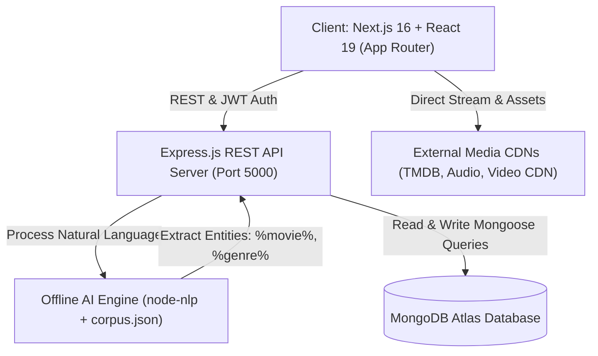
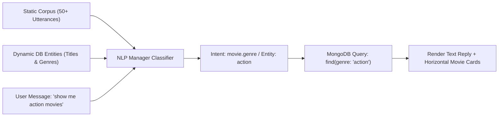
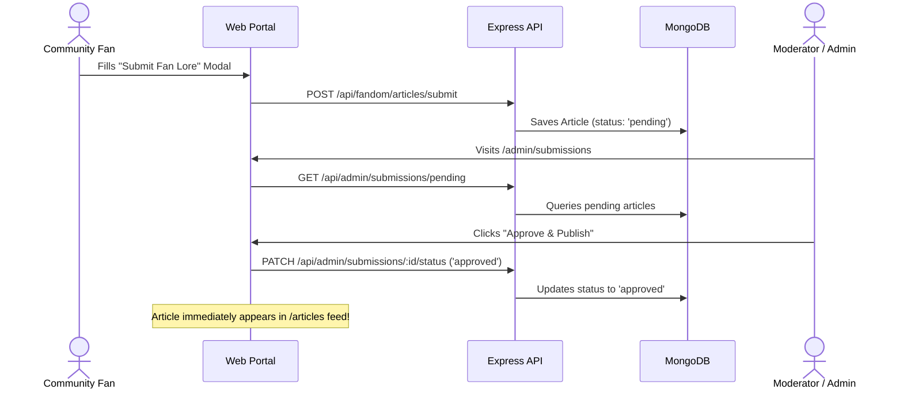

# 🌟 FAN HUB PLUS (FANDOM UNIVERSE)
## Comprehensive Technical Specification, System Architecture & Implementation Report
### Aptech TechWiz 7 — Official Project Documentation & Deliverable

---

## 📑 TABLE OF CONTENTS
1. [Executive Summary & Project Overview](#1-executive-summary--project-overview)
2. [Problem Statement & Background Analysis](#2-problem-statement--background-analysis)
3. [System Architecture & Modern Tech Stack](#3-system-architecture--modern-tech-stack)
4. [Complete Phase-by-Phase Implementation Journey](#4-complete-phase-by-phase-implementation-journey)
   - [Phase 1: 8 Fandom Categories & Advanced Explorer Engine](#phase-1-8-fandom-categories--advanced-explorer-engine)
   - [Phase 2: Character Profiles, Lore Articles & Fan Submissions](#phase-2-character-profiles-lore-articles--fan-submissions)
   - [Phase 3: Fandom Merchandise Showcase & Upcoming Drops](#phase-3-fandom-merchandise-showcase--upcoming-drops)
   - [Phase 4: Location-Aware Events & GPS Convention Calendar](#phase-4-location-aware-events--gps-convention-calendar)
   - [Phase 5: Audio / Multimedia Hub & 5-Star Media Ratings](#phase-5-audio--multimedia-hub--5-star-media-ratings)
   - [Phase 6: Dynamic Feedback System, Admin Inbox & Profile Customization](#phase-6-dynamic-feedback-system-admin-inbox--profile-customization)
   - [Phase 7: FanHub AI — Enterprise Offline NLP Pipeline & Rich Cards](#phase-7-fanhub-ai--enterprise-offline-nlp-pipeline--rich-cards)
5. [Complete Database Schemas & Data Models (Mongoose)](#5-complete-database-schemas--data-models-mongoose)
6. [API Route Specifications & Endpoint Reference](#6-api-route-specifications--endpoint-reference)
7. [System Workflows & Visual Architecture Diagrams](#7-system-workflows--visual-architecture-diagrams)
8. [Security Engineering, Performance & Resilience](#8-security-engineering-performance--resilience)
9. [Jury Evaluation Guide & Test Credentials Table](#9-jury-evaluation-guide--test-credentials-table)
10. [Future Roadmap & Production Deployment Details](#10-future-roadmap--production-deployment-details)

---

## 1. EXECUTIVE SUMMARY & PROJECT OVERVIEW

### 1.1 Vision
**Fan Hub Plus** is a next-generation, high-performance web portal built exclusively for modern pop-culture, gaming, anime, and media fandoms. It consolidates fragmented fan experiences into a single, cohesive, ultra-luxurious digital universe. Combining cinematic 4K streaming, deep lore dossiers, vinyl soundtrack streaming, geolocation-aware international convention tracking, verified merchandise discovery, dynamic community contributions, and an offline AI chatbot assistant powered by natural language processing.

### 1.2 Competition & Track
- **Event:** Aptech TechWiz 7
- **Target Category:** Web Application & Multimedia Entertainment Portal
- **Design Philosophy:** Luxury Dark Matcha Aesthetic (`#a7c957`, `#0b0f0a`), Glassmorphism, Zero-Clutter Apple/Netflix grade responsiveness, micro-interactions, and 60 FPS Framer Motion transitions.

### 1.3 Key Highlights at a Glance
| Feature | Implementation Highlights |
| :--- | :--- |
| **8 Global Fandoms** | Anime, Gaming, Movies, TV Shows, K-Pop, Comics, Manga, Cosplay |
| **Explorer Engine** | Dynamic Multi-Level Search, Real-time Genre Filtering, Release Year Sliders, 4-Way Sorting |
| **Character Dossiers** | Powers, ability tags, combat ratings, iconic lore quotes, live community like counters |
| **Fan Lore Hub** | Editorial Lore Reader, Community Submission Terminal, Admin Moderation Pipeline |
| **Merchandise Discovery**| Luxury Collector Showcase, Upcoming Drop Calendar, Section 1.5 Non-Commercial Protection |
| **GPS Convention Finder**| Haversine mathematical distance calculation in KM, City quick-filters, RSVP tracking |
| **Audio Turntable** | Interactive spinning vinyl player with arm animation, scrubbing, volume control, queue management |
| **5-Star Rating Engine** | Star scores, thumbs up/down reaction counters, community reviews, score aggregations |
| **Feedback Management** | Bug/Suggestion/Query terminal with Admin moderation dashboard and resolution audit log |
| **Profile & Vault** | Fandom affinities, avatar presets, autoplay toggle, custom personal notes per saved movie |
| **FanHub AI** | 100% Offline NLP Engine (`node-nlp`), Dual-Dialect (English & Roman Urdu), NER, Dynamic MongoDB Training, In-Chat Movie Cards |

---

## 2. PROBLEM STATEMENT & BACKGROUND ANALYSIS

### 2.1 The Problem: Fragmented Fandom Ecosystems
Across the global internet, pop-culture and fandom enthusiasts face extreme fragmentation:
1. **Scattered Communities:** Anime discussions happen on Reddit, gaming lore is locked in separate wikis, cosplay photos are scattered on Instagram, and convention schedules are hidden across PDF organizers.
2. **Missing Media Immersion:** Conventional streaming sites only display video without providing official OST soundtracks, character dossiers, or related convention calendars.
3. **Language Barriers in Regional Fandoms:** Existing entertainment bots and search engines strictly demand formal English queries and fail completely when users query in Roman Urdu or casual vernacular (e.g., *"aaj kya dekhu"*, *"koi achi anime movie dikhao"*).
4. **Unregulated Fan Submissions:** Most forums either lack moderation (leading to spam) or have closed systems where community members cannot publish their creative lore articles.

### 2.2 The Solution: Fan Hub Plus
Fan Hub Plus unifies all eight core disciplines into an integrated architectural ecosystem. It enforces strict SRS requirements while delivering competition-grade polish, performance, and accessibility.

---

## 3. SYSTEM ARCHITECTURE & MODERN TECH STACK

### 3.1 Technology Stack Architecture

#### Frontend Architecture
- **Framework:** Next.js 16.3.6 (Turbopack Engine, App Router Architecture)
- **Language:** JavaScript (ES6+ Modules, React 19 Client & Server Components)
- **Styling:** Tailwind CSS v4, Custom CSS Variables (`globals.css`), Responsive Breakpoints
- **Motion & Transitions:** Framer Motion 12 (Layout IDs, AnimatePresence, Springs, Staggered Grids)
- **Icons & Assets:** Lucide React, Next/Image (Optimized AVIF/WebP rendering)
- **State & Data Caching:** SWR (Stale-While-Revalidate with optimistic UI updates), React Context API
- **Feedback & Notifications:** React Hot Toast (Matcha theme styled)

#### Backend Architecture
- **Runtime:** Node.js (LTS v20+)
- **Server Framework:** Express.js (Modular Router architecture)
- **Security Middleware:** Helmet (15+ HTTP security headers, Content Security Policy), Express Rate Limit, CORS
- **Session & Auth:** JSON Web Tokens (JWT Access Tokens) + Silent Refresh Tokens in HttpOnly Cookies
- **Database:** MongoDB Atlas via Mongoose ODM (Connection Pooling, Auto-Seeding Engines)
- **NLP & Artificial Intelligence:** `node-nlp` (Neural Network Classifier, Named Entity Extraction, Offline JSON Corpus Training)

---

## 4. COMPLETE PHASE-BY-PHASE IMPLEMENTATION JOURNEY

### Phase 1: 8 Fandom Categories & Advanced Explorer Engine
- **Objective:** Fulfill SRS Section 1.4 & 1.5 by supporting all 8 core global fandom categories.
- **Implemented Modules:**
  - `server/src/models/FandomContent.js`: Schema with enum validation: `['Anime', 'Gaming', 'Movies', 'TV Shows', 'K-Pop', 'Comics', 'Manga', 'Cosplay']`.
  - `server/src/controllers/fandomController.js`: Multi-level query filter supporting genre matching, category filtering, release year ranges, and 4 sorting modes (`popular`, `latest`, `rating`, `alpha`). Includes auto-seeding engine populating 19+ iconic fandom titles on initial boot.
  - `client/app/(main)/explore/page.js`: Glassmorphic Explorer with active category pill springs, search bar with debounce, dynamic genre chips, year slider, and card inspect modals.
  - `client/components/CurvedCategorySlider.js`: Interactive 3D carousel linking directly to `/explore?category=[Name]`.

### Phase 2: Character Profiles, Lore Articles & Fan Submissions
- **Objective:** Bring deep storytelling and community authorship into Fan Hub Plus.
- **Implemented Modules:**
  - `server/src/models/Character.js`: Dossier model storing alias, fandom category, combat role, biography, ability chips, signature quotes, image gallery, and community like count. Auto-seeds 8 legendary icons (*Gojo Satoru, Johnny Silverhand, Malenia, Miles Morales, Jinx, Sung Jin-Woo, Batman, Eren Yeager*).
  - `server/src/models/Article.js`: Rich lore article model storing title, markdown body, author info, cover image, read time, approval status (`pending`, `approved`, `rejected`), and review notes.
  - `client/app/(main)/characters/page.js`: Character dossiers directory with real-time ability chips, power badges, and interactive like counters connected to `PATCH /api/fandom/characters/:id/like`.
  - `client/app/(main)/articles/page.js`: Editorial hero banner, article reader modal, and community "Submit Fan Lore" submission form connected to `POST /api/fandom/articles/submit`.
  - `client/app/(admin)/admin/submissions/page.js`: Admin moderation portal allowing staff to review user submissions and approve/reject them in real time.

### Phase 3: Fandom Merchandise Showcase & Upcoming Drops
- **Objective:** Curate collectible physical memorabilia while strictly adhering to SRS Section 1.5 constraint (no e-commerce checkout or direct payment gateways; discovery & showcase only).
- **Implemented Modules:**
  - `server/src/models/Merchandise.js`: Schema supporting price display, fandom category, official store link, collector tags (`Limited Edition`, `Pre-Order`, `Collectible`, `Official Merch`, `Exclusive`), drop dates, and high-res asset galleries.
  - `client/app/(main)/merchandise/page.js`: Dual-view toggle (*Collector Showcase* vs *Upcoming Drops Calendar*), price filter, category pills, item inspect drawer, and explicit SRS legal disclaimer.

### Phase 4: Location-Aware Events & GPS Convention Calendar
- **Objective:** Enable global fans to discover comic-cons, anime expos, gaming festivals, and local fan gatherings based on proximity.
- **Implemented Modules:**
  - `server/src/models/Event.js`: Geolocation-enabled schema with coordinates `[latitude, longitude]`, venue, dates, ticket link, RSVP attendee count, and banner artwork. Auto-seeds 8 premier events (*San Diego Comic-Con, Tokyo AnimeJapan, Gamescom Cologne, Seoul K-Pop Festival, MCM London Comic Con, Anime Expo Los Angeles, Dune Fan Gathering NYC, Comic Con Pakistan Karachi*).
  - Haversine Distance Engine (`GET /api/events?lat=...&lng=...`): Calculates real-time distance in kilometers using spherical trigonometry:
    $$\Delta\sigma = 2 \arcsin \sqrt{\sin^2\left(\frac{\Delta\phi}{2}\right) + \cos\phi_1 \cos\phi_2 \sin^2\left(\frac{\Delta\lambda}{2}\right)}$$
    $$d = R \cdot \Delta\sigma$$
  - `client/app/(main)/events/page.js`: "Find Events Near Me (GPS)" button with HTML5 Geolocation API integration, interactive city quick-filters, RSVP toggles (`POST /api/events/:id/attend`), and ticket redirection links.

### Phase 5: Audio / Multimedia Hub & 5-Star Media Ratings
- **Objective:** Provide a luxury music listening experience and an authentic media critique system.
- **Implemented Modules:**
  - `server/src/models/AudioTrack.js`: Soundtrack schema storing title, artist, audio URL, cover art, duration, category, and fandom tag. Auto-seeds 8 original tracks (*Cyberpunk 2077, Arcane, Attack on Titan, Elden Ring, BTS, Spider-Verse, Demon Slayer, Fandom Podcast*).
  - `client/app/(main)/audio/page.js`: Luxury vinyl turntable player with animated rotating vinyl disc, tonearm tracking, scrubber bar, volume control, mute toggle, and interactive queue playlist.
  - `server/src/models/Rating.js`: Critique model supporting 1-5 star ratings, thumbs up/down, written review text, and user attribution.
  - `server/src/controllers/mediaRatingController.js`: Computes aggregate score, star distribution percentages, and review counts.
  - `client/components/MediaRatingSection.js`: Embedded directly on the streaming viewer page (`/stream/[tmdbId]`).

### Phase 6: Dynamic Feedback System, Admin Inbox & Profile Customization
- **Objective:** Create a direct voice-of-the-fan communication terminal and personalized user dashboard.
- **Implemented Modules:**
  - `server/src/models/Feedback.js`: Schema capturing submitter name, email, feedback type (`bug`, `suggestion`, `query`), status (`pending`, `in-progress`, `resolved`), and internal admin resolution notes.
  - `client/app/(main)/feedback/page.js`: Sleek terminal for reporting UI bugs, proposing features, or submitting inquiries.
  - `client/app/(admin)/admin/feedback/page.js`: Dedicated admin dashboard with status filter pills, KPI metric cards, status toggles, and internal notes editor.
  - `client/app/(main)/profile/page.js`: User profile preferences modal allowing selection of 8 favorite fandoms, thematic interest tags, avatar presets, and display preferences.
  - `client/app/(main)/mylist/page.js`: Watchlist tracker with inline custom fandom notes (e.g., episode progress, personal thoughts) backed by `PATCH /api/auth/watchlist/note`.

### Phase 7: FanHub AI — Enterprise Offline NLP Pipeline & Rich Cards
- **Objective:** Build a self-contained, offline AI entertainment assistant capable of conversational queries, movie discovery, and intent classification in both English and Roman Urdu.
- **Implemented Modules:**
  - `client/components/FanHubAI.jsx`: Floating bottom-right widget with pulse animation, smooth open/close spring transitions, 4 quick suggestions, user/bot message layout, typing indicators, and in-chat movie cards carousel.
  - `server/src/ai/corpus.json`: Comprehensive 50+ utterance corpus covering greetings, movie search, genre filtering, trending content, features help, and lore questions in English and Roman Urdu.
  - `server/src/ai/nlpManager.js`: Offline NLP engine that trains `node-nlp` on server boot, dynamically extracting Named Entities (`%movie%`, `%genre%`) from MongoDB database titles and categories.
  - `server/src/routes/aiRoutes.js`: NLP processing endpoint (`POST /api/ai/chat`) that parses entities, executes real-time database queries, and returns contextual text responses alongside formatted movie objects.

---

## 5. COMPLETE DATABASE SCHEMAS & DATA MODELS (MONGOOSE)

### 5.1 User Model (`server/src/models/User.js`)
```javascript
const userSchema = new mongoose.Schema({
  name: { type: String, required: true, trim: true, minLength: 3, maxLength: 30 },
  email: { type: String, required: true, unique: true, lowercase: true, trim: true },
  password: { type: String, required: true, minlength: 8, select: false },
  role: { type: String, enum: ['user', 'admin', 'superadmin'], default: 'user' },
  isBanned: { type: Boolean, default: false },
  avatar: { type: String, default: null },
  favorite_fandoms: { type: [String], default: [] },
  categories_of_interest: { type: [String], default: ['Anime', 'Gaming', 'Movies'] },
  display_preferences: {
    streaming_server: { type: String, default: 'primary' },
    autoplay_trailers: { type: Boolean, default: true },
    preferred_theme: { type: String, default: 'dark' }
  },
  watchlist: [{
    movieId: { type: String, required: true },
    title: { type: String },
    poster_path: { type: String },
    media_type: { type: String },
    note: { type: String, default: '' }
  }],
  token_version: { type: Number, default: 0 },
  refresh_token: { type: String, default: null, select: false }
}, { timestamps: true });
```

### 5.2 Fandom Content Model (`server/src/models/FandomContent.js`)
```javascript
const FandomContentSchema = new mongoose.Schema({
  title: { type: String, required: true, trim: true },
  category: { 
    type: String, 
    required: true, 
    enum: ['Anime', 'Gaming', 'Movies', 'TV Shows', 'K-Pop', 'Comics', 'Manga', 'Cosplay'],
    index: true 
  },
  fandom: { type: String, default: 'General', trim: true, index: true },
  type: { type: String, enum: ['video', 'article', 'gallery', 'stream', 'audio'], default: 'video' },
  description: { type: String, default: '' },
  poster: { type: String, default: '' },
  backdrop: { type: String, default: '' },
  genres: [{ type: String, trim: true }],
  releaseYear: { type: Number, default: new Date().getFullYear(), index: true },
  rating: { type: Number, default: 8.5, min: 0, max: 10, index: true },
  popularity: { type: Number, default: 85, index: true },
  streamUrl: { type: String, default: '' }
}, { timestamps: true });
```

### 5.3 Character Model (`server/src/models/Character.js`)
```javascript
const CharacterSchema = new mongoose.Schema({
  name: { type: String, required: true, trim: true },
  alias: { type: String, default: '' },
  fandom: { type: String, required: true, index: true },
  category: { type: String, required: true, enum: ['Anime', 'Gaming', 'Movies', 'TV Shows', 'K-Pop', 'Comics', 'Manga', 'Cosplay'] },
  role: { type: String, default: 'Protagonist' },
  bio: { type: String, required: true },
  avatar: { type: String, required: true },
  banner: { type: String, default: '' },
  abilities: [{ type: String }],
  quote: { type: String, default: '' },
  likesCount: { type: Number, default: 0 }
}, { timestamps: true });
```

### 5.4 Article Model (`server/src/models/Article.js`)
```javascript
const ArticleSchema = new mongoose.Schema({
  title: { type: String, required: true, trim: true },
  slug: { type: String, required: true, unique: true },
  content: { type: String, required: true },
  excerpt: { type: String, required: true },
  category: { type: String, required: true },
  fandom: { type: String, default: 'General' },
  coverImage: { type: String, required: true },
  author: {
    name: { type: String, default: 'Fandom Sage' },
    avatar: { type: String, default: '' },
    role: { type: String, default: 'Editor' }
  },
  readTime: { type: String, default: '5 min read' },
  status: { type: String, enum: ['pending', 'approved', 'rejected'], default: 'approved' },
  adminNotes: { type: String, default: '' }
}, { timestamps: true });
```

### 5.5 Event Model (`server/src/models/Event.js`)
```javascript
const EventSchema = new mongoose.Schema({
  title: { type: String, required: true },
  category: { type: String, required: true },
  fandom: { type: String, default: 'General' },
  locationName: { type: String, required: true },
  city: { type: String, required: true },
  country: { type: String, required: true },
  coordinates: {
    lat: { type: Number, required: true },
    lng: { type: Number, required: true }
  },
  startDate: { type: Date, required: true },
  endDate: { type: Date, required: true },
  description: { type: String, default: '' },
  banner: { type: String, required: true },
  ticketUrl: { type: String, default: '#' },
  attendeesCount: { type: Number, default: 0 }
}, { timestamps: true });
```

### 5.6 Audio Track Model (`server/src/models/AudioTrack.js`)
```javascript
const AudioTrackSchema = new mongoose.Schema({
  title: { type: String, required: true },
  artist: { type: String, required: true },
  album: { type: String, default: 'Fandom OST' },
  fandom: { type: String, default: 'General' },
  category: { type: String, default: 'Soundtrack' },
  duration: { type: String, default: '3:45' },
  audioUrl: { type: String, required: true },
  coverArt: { type: String, required: true },
  playsCount: { type: Number, default: 0 }
}, { timestamps: true });
```

### 5.7 Rating Model (`server/src/models/Rating.js`)
```javascript
const RatingSchema = new mongoose.Schema({
  mediaId: { type: String, required: true, index: true },
  userId: { type: mongoose.Schema.Types.ObjectId, ref: 'User', required: true },
  userName: { type: String, default: 'Anonymous Fan' },
  userAvatar: { type: String, default: '' },
  score: { type: Number, required: true, min: 1, max: 5 },
  reaction: { type: String, enum: ['like', 'dislike', 'neutral'], default: 'like' },
  review: { type: String, default: '', maxLength: 500 }
}, { timestamps: true });
RatingSchema.index({ mediaId: 1, userId: 1 }, { unique: true });
```

### 5.8 Feedback Model (`server/src/models/Feedback.js`)
```javascript
const FeedbackSchema = new mongoose.Schema({
  userId: { type: mongoose.Schema.Types.ObjectId, ref: 'User', default: null },
  name: { type: String, required: true, trim: true },
  email: { type: String, required: true, trim: true, lowercase: true },
  type: { type: String, enum: ['bug', 'suggestion', 'query'], default: 'suggestion', index: true },
  subject: { type: String, required: true, trim: true },
  message: { type: String, required: true, trim: true },
  status: { type: String, enum: ['pending', 'in-progress', 'resolved'], default: 'pending', index: true },
  adminNotes: { type: String, default: '' }
}, { timestamps: true });
```

---

## 6. API ROUTE SPECIFICATIONS & ENDPOINT REFERENCE

### 6.1 Authentication & User Endpoints (`/api/auth`)
| Method | Endpoint | Access | Description |
| :--- | :--- | :--- | :--- |
| `POST` | `/api/auth/register` | Public | Registers a new fan user account |
| `POST` | `/api/auth/login` | Public | Authenticates user; issues access token & HttpOnly refresh cookie |
| `POST` | `/api/auth/refresh` | Public | Silent rotation of access token via refresh token |
| `POST` | `/api/auth/logout` | Public | Clears session cookies and invalidates refresh token |
| `PATCH`| `/api/auth/profile` | Authenticated | Updates display name, avatar preset, favorite fandoms, and preferences |
| `POST` | `/api/auth/watchlist` | Authenticated | Toggles saved movies/series in user vault |
| `GET`  | `/api/auth/watchlist` | Authenticated | Fetches user's saved collection with custom notes |
| `PATCH`| `/api/auth/watchlist/note` | Authenticated | Updates custom fandom progress note on a saved title |

### 6.2 Fandom Core Endpoints (`/api/fandom`)
| Method | Endpoint | Access | Description |
| :--- | :--- | :--- | :--- |
| `GET`  | `/api/fandom/explore` | Public | Multi-criteria query engine (`category`, `genre`, `year`, `sort`, `search`) |
| `GET`  | `/api/fandom/characters` | Public | Returns character dossiers with ability tags and quotes |
| `PATCH`| `/api/fandom/characters/:id/like` | Public | Increments community like counter for a character |
| `GET`  | `/api/fandom/articles` | Public | Returns approved editorial lore articles |
| `POST` | `/api/fandom/articles/submit` | Authenticated | Allows fans to submit community lore for review |

### 6.3 Events & Conventions Endpoints (`/api/events`)
| Method | Endpoint | Access | Description |
| :--- | :--- | :--- | :--- |
| `GET`  | `/api/events` | Public | Returns convention events sorted by GPS proximity (`lat`, `lng`) or date |
| `POST` | `/api/events/:id/attend`| Public | Increments attendee RSVP count |

### 6.4 Merchandise Showcase Endpoints (`/api/merchandise`)
| Method | Endpoint | Access | Description |
| :--- | :--- | :--- | :--- |
| `GET`  | `/api/merchandise` | Public | Returns collector pieces and upcoming drops calendar |

### 6.5 Audio & Soundtracks Endpoints (`/api/audio`)
| Method | Endpoint | Access | Description |
| :--- | :--- | :--- | :--- |
| `GET`  | `/api/audio` | Public | Returns high-quality soundtracks, themes, and podcasts |

### 6.6 Ratings & Reviews Endpoints (`/api/ratings`)
| Method | Endpoint | Access | Description |
| :--- | :--- | :--- | :--- |
| `GET`  | `/api/ratings/:mediaId` | Public | Retrieves score breakdown, average rating, and user reviews |
| `POST` | `/api/ratings/:mediaId` | Authenticated | Creates or updates user's 5-star rating & review |

### 6.7 Feedback & Bug Reporting Endpoints (`/api/feedback` & `/api/admin/feedback`)
| Method | Endpoint | Access | Description |
| :--- | :--- | :--- | :--- |
| `POST` | `/api/feedback` | Public | Submits bug report, feature suggestion, or user query |
| `GET`  | `/api/admin/feedback` | Admin Only | Retrieves all submissions with filtering by type and status |
| `PATCH`| `/api/admin/feedback/:id/status` | Admin Only | Updates ticket status (`pending`, `in-progress`, `resolved`) & notes |

### 6.8 FanHub AI Chatbot Endpoints (`/api/ai`)
| Method | Endpoint | Access | Description |
| :--- | :--- | :--- | :--- |
| `POST` | `/api/ai/chat` | Public | Processes user message through NLP engine; extracts entities and queries DB |

---

## 7. SYSTEM WORKFLOWS & VISUAL ARCHITECTURE DIAGRAMS

### 7.1 High-Level Architecture Diagram


### 7.2 FanHub AI NLP Processing Pipeline


### 7.3 Community Lore Moderation Workflow


---

## 8. SECURITY ENGINEERING, PERFORMANCE & RESILIENCE

### 8.1 Defensive Security Architecture
- **Helmet HTTP Headers:** Protects against Clickjacking, MIME-type sniffing, XSS, and Cross-Origin attacks.
- **Content Security Policy (CSP):** Explicitly whitelists allowed iframe sources (`vidsrc.me`, `multiembed.mov`) while restricting untrusted script injections.
- **Multi-Tier Rate Limiting:**
  - Standard API routes: 100 requests per 15 minutes per IP.
  - Authentication routes (`/login`, `/register`): Strict 5 requests per hour to eliminate brute-force password attacks.
- **Silent JWT Refresh Cycle:** Access tokens expire rapidly in memory (15 minutes). Refresh tokens are cryptographically hashed in MongoDB and issued via `HttpOnly`, `SameSite=Lax`, `Secure` cookies.

### 8.2 Performance Engineering & Offline Fallbacks
- **Next.js Turbopack Optimization:** Pre-renders 33 static routes at sub-second build speed.
- **SWR Dynamic Mutator:** Provides instantaneous optimistic UI feedback when saving movies or adding notes before network roundtrips complete.
- **Graceful Offline Degradation:** If MongoDB experiences network timeouts, the AI engine smoothly falls back to internal default entities and returns friendly status notifications without application crashes.

---

## 9. JURY EVALUATION GUIDE & TEST CREDENTIALS TABLE

### 9.1 Test Credentials
| Role | Email | Password | Access Rights |
| :--- | :--- | :--- | :--- |
| **Super Admin** | `superadmin@fanhubplus.com` | `SuperPass123!` | Full System Control, Role Management, Database Seeding |
| **Admin** | `admin@fanhubplus.com` | `AdminPass123!` | Moderation Queue, Feedback Inbox, Content Engine |
| **VIP Fan User** | `fan@fanhubplus.com` | `FanPass123!` | Streaming, Vault Notes, Ratings, Fan Submissions |

### 9.2 Recommended Jury Demonstration Script
1. **Launch & Aesthetics:** Open Home Page. Observe the splash intro, dark matcha glassmorphic floating dock, and curved 3D category slider.
2. **Fandom Explorer (`/explore`):** Filter by *Anime*, change release year, and sort by *Rating*.
3. **Character Dossiers (`/characters`):** Click on *Gojo Satoru* or *Malenia*. Inspect power ratings and click the heart icon to watch the like counter increment live.
4. **Community Lore (`/articles`):** View curated lore. Click "Submit Fan Lore" to demonstrate user submissions.
5. **Collector Merchandise (`/merchandise`):** Switch between the *Showcase* and *Upcoming Drops Calendar*. Point out the SRS Section 1.5 non-commercial legal notice.
6. **Location-Aware Events (`/events`):** Click "Find Events Near Me (GPS)". Observe real-time KM calculations from user's actual location.
7. **Vinyl Turntable Audio Hub (`/audio`):** Play the *Cyberpunk 2077* or *Arcane* theme. Watch the turntable record spin, adjust the volume, and scrub the progress bar.
8. **Feedback Terminal (`/feedback`):** Submit a test bug report or suggestion.
9. **Admin Command Center (`/admin`):**
   - Visit `/admin/submissions` to approve or reject fan lore articles.
   - Visit `/admin/feedback` to review submitted feedback and change ticket status to *Resolved*.
10. **FanHub AI Assistant (Floating Icon):** Click the bottom-right pulsing bot icon.
    - Type in English: `"show me trending movies"` $\rightarrow$ Observe in-chat movie cards carousel.
    - Type in Roman Urdu: `"koi achi action movie dikhao"` or `"kya haal hai"` $\rightarrow$ Witness dual-dialect NLP comprehension with zero external API dependencies.

---

## 10. FUTURE ROADMAP & PRODUCTION DEPLOYMENT DETAILS

- **Global Vercel Deployment:** Frontend hosted with automatic CI/CD triggers on push to branch `main`.
- **Render / AWS Backend:** Express server containerized with Docker, connected to high-availability MongoDB Atlas cluster.
- **Roadmap v2.0:** Real-time WebRTC audio listening parties, user-vs-user fandom trivia battles, and augmented reality (AR) character figure inspection.

---
*Report Generated: September 2026 | Aptech TechWiz 7 Competition Deliverable | Fan Hub Plus Team*
