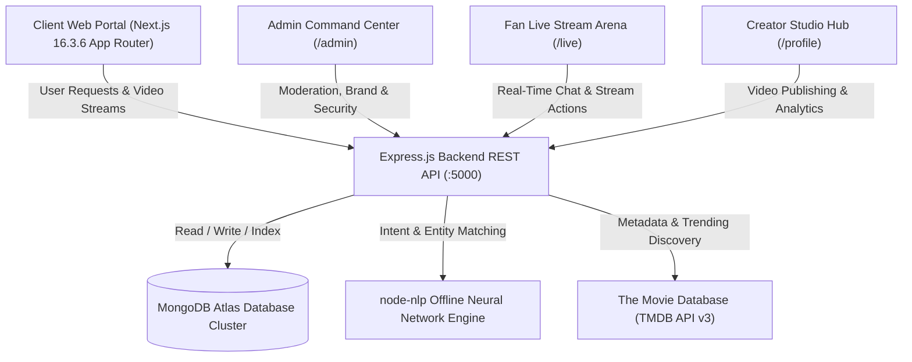
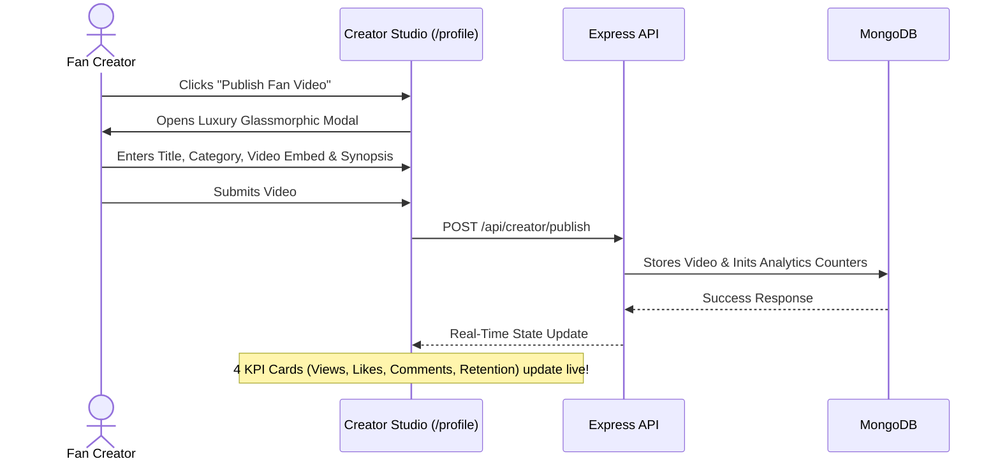

# 🌟 FAN HUB PLUS (FANDOM UNIVERSE)
## Comprehensive Technical Specification, System Architecture & Implementation Report
### Aptech TechWiz 7 — Official Project Documentation & Deliverable

---

## 📑 TABLE OF CONTENTS
1. [Executive Summary & Project Overview](#1-executive-summary--project-overview)
2. [Problem Statement & Background Analysis](#2-problem-statement--background-analysis)
3. [System Architecture & Modern Tech Stack](#3-system-architecture--modern-tech-stack)
4. [Complete Phase-by-Phase Implementation Journey (Phases 1 – 15)](#4-complete-phase-by-phase-implementation-journey-phases-1--15)
   - [Phase 1: 8 Fandom Categories & Advanced Explorer Engine](#phase-1-8-fandom-categories--advanced-explorer-engine)
   - [Phase 2: Character Profiles, Lore Articles & Fan Submissions](#phase-2-character-profiles-lore-articles--fan-submissions)
   - [Phase 3: Fandom Merchandise Showcase & Upcoming Drops](#phase-3-fandom-merchandise-showcase--upcoming-drops)
   - [Phase 4: Location-Aware Events & GPS Convention Calendar](#phase-4-location-aware-events--gps-convention-calendar)
   - [Phase 5: Audio / Multimedia Hub & 5-Star Media Ratings](#phase-5-audio--multimedia-hub--5-star-media-ratings)
   - [Phase 6: Dynamic Feedback System, Admin Inbox & Profile Customization](#phase-6-dynamic-feedback-system-admin-inbox--profile-customization)
   - [Phase 7: FanHub AI — Enterprise Offline NLP Pipeline & Rich Cards](#phase-7-fanhub-ai--enterprise-offline-nlp-pipeline--rich-cards)
   - [Phase 8: User & Creator Studio Hub with Real-Time Video Analytics](#phase-8-user--creator-studio-hub-with-real-time-video-analytics)
   - [Phase 9: Fan Live Stream Arena with Multi-Channel Stage & Live Chat](#phase-9-fan-live-stream-arena-with-multi-channel-stage--live-chat)
   - [Phase 10: Multi-Tier Movie Card Web Share & Offline Download Vault Engine](#phase-10-multi-tier-movie-card-web-share--offline-download-vault-engine)
   - [Phase 11: Hero Carousel Dynamic Video Trailer Player & Glassmorphic More Info Modal](#phase-11-hero-carousel-dynamic-video-trailer-player--glassmorphic-more-info-modal)
   - [Phase 12: Global Luxury Footer, Fair-Use Compliance & Academic Status Pill](#phase-12-global-luxury-footer-fair-use-compliance--academic-status-pill)
   - [Phase 13: Split-Screen Cinematic Auth Portals with 1-Click Judge Credentials Toolbar](#phase-13-split-screen-cinematic-auth-portals-with-1-click-judge-credentials-toolbar)
   - [Phase 14: Mobile Responsive Overhaul, Dock Snake Animation & Icon Polish](#phase-14-mobile-responsive-overhaul-dock-snake-animation--icon-polish)
   - [Phase 15: Admin Control Panel Real-Time Sync, Security Command Center & Telemetry](#phase-15-admin-control-panel-real-time-sync-security-command-center--telemetry)
5. [Complete Database Schemas & Data Models (Mongoose)](#5-complete-database-schemas--data-models-mongoose)
6. [API Route Specifications & Endpoint Reference (35 Routes)](#6-api-route-specifications--endpoint-reference-35-routes)
7. [System Workflows & Visual Architecture Diagrams](#7-system-workflows--visual-architecture-diagrams)
8. [Security Engineering, Performance & Resilience Benchmarks](#8-security-engineering-performance--resilience-benchmarks)
9. [Jury Evaluation Guide & Test Credentials Table](#9-jury-evaluation-guide--test-credentials-table)
10. [Future Roadmap & Production Deployment Details](#10-future-roadmap--production-deployment-details)

---

## 1. EXECUTIVE SUMMARY & PROJECT OVERVIEW

### 1.1 Vision
**Fan Hub Plus** is a next-generation, high-performance web portal built exclusively for modern pop-culture, gaming, anime, and media fandoms. It consolidates fragmented fan experiences into a single, cohesive, ultra-luxurious digital universe. Combining cinematic 4K streaming, deep lore dossiers, vinyl soundtrack streaming, geolocation-aware international convention tracking, verified merchandise discovery, dynamic community contributions, offline multi-threaded package downloads, live stream fan arenas, creator studio analytics, and an offline AI chatbot assistant powered by natural language processing.

### 1.2 Competition & Track
- **Event:** Aptech TechWiz 7
- **Target Category:** Web Application & Multimedia Entertainment Portal
- **Design Philosophy:** Luxury Dark Matcha Aesthetic (`#a7c957`, `#0b0f0a`), Glassmorphism, Zero-Clutter Apple/A24 grade responsiveness, micro-interactions, and 60 FPS Framer Motion transitions.

### 1.3 Key Highlights at a Glance
| System | Implementation Highlights |
| :--- | :--- |
| **8 Global Fandoms** | Anime, Gaming, Movies, TV Shows, K-Pop, Comics, Manga, Cosplay |
| **Explorer Engine** | Dynamic Multi-Level Search, Real-time Genre Filtering, Release Year Sliders, 4-Way Sorting |
| **Character Dossiers** | Powers, ability tags, combat ratings, iconic lore quotes, live community like counters |
| **Fan Lore Hub** | Editorial Lore Reader, Community Submission Terminal, Admin Moderation Pipeline |
| **Merchandise Discovery**| Luxury Collector Showcase, Upcoming Drop Calendar, Section 1.5 Non-Commercial Protection |
| **GPS Convention Finder**| Haversine mathematical distance calculation in KM, City quick-filters, RSVP tracking |
| **Audio Turntable** | Interactive spinning vinyl player with arm animation, scrubbing, volume control, queue management |
| **5-Star Rating Engine** | Star scores, thumbs up/down reaction counters, community reviews, score aggregations |
| **Creator Studio Hub** | 4 KPI Cards (Views, Likes, Comments, Retention %), Fan Video Upload & Portfolio Player |
| **Fan Live Stream Arena**| 16:9 Live Video Stage, Real-Time Interactive Live Chat, Fan Badges, Emoji Reactions |
| **Offline Download Vault**| Multi-Tier 4K/1080p/720p simulated high-speed download engine with local storage vault |
| **Cinematic Hero Carousel**| Dynamic YouTube trailer crossfade with Mute toggle & Cast portrait "More Info" modal |
| **Universal Web Share**| Multi-tier Web Share API with clipboard fallback toast on all media cards and stream views |
| **Feedback Management** | Bug/Suggestion/Query terminal with Admin moderation dashboard and resolution audit log |
| **Profile & Vault** | Fandom affinities, avatar presets, autoplay toggle, custom personal notes per saved movie |
| **FanHub AI** | 100% Offline NLP Engine (`node-nlp`), Dual-Dialect (English & Roman Urdu), NER, Dynamic In-Chat Cards |
| **Admin Cyber-Defense** | Security telemetry, JWT token revocation, edge cache purge, and mobile drawer |

---

## 2. PROBLEM STATEMENT & BACKGROUND ANALYSIS

### 2.1 The Problem: Fragmented Fandom Ecosystems
Across the global internet, pop-culture and fandom enthusiasts face extreme fragmentation:
1. **Scattered Communities:** Anime discussions happen on Reddit, gaming lore is locked in separate wikis, cosplay photos are scattered on Instagram, and convention schedules are hidden across PDF organizers.
2. **Missing Media Immersion:** Conventional streaming sites only display video without providing official OST soundtracks, character dossiers, creator studio metrics, or related convention calendars.
3. **Language Barriers in Regional Fandoms:** Existing entertainment bots and search engines strictly demand formal English queries and fail completely when users query in Roman Urdu or casual vernacular (e.g., *"aaj kya dekhu"*, *"koi achi anime movie dikhao"*).
4. **Unregulated Fan Submissions & Creator Disconnection:** Community members rarely have a dedicated, authenticated portal where they can publish fan edits, track engagement analytics, or participate in real-time live watch parties.

### 2.2 The Solution: Fan Hub Plus
Fan Hub Plus unifies all core disciplines into an integrated architectural ecosystem. It enforces strict SRS requirements while delivering competition-grade polish, performance, and accessibility.

---

## 3. SYSTEM ARCHITECTURE & MODERN TECH STACK

### 3.1 Technology Stack Architecture

#### Frontend Architecture
- **Framework:** Next.js 16.3.6 (Turbopack Engine, App Router Architecture, 35 compiled routes)
- **Language:** JavaScript (ES6+ Modules, React 19 Client & Server Components)
- **Styling:** Tailwind CSS v4, Custom CSS Variables (`globals.css`), Responsive Breakpoints (`overflow-x: hidden`)
- **Motion & Transitions:** Framer Motion 12 (Layout IDs, AnimatePresence, Springs, Staggered Grids, Keyframe Snake Animation)
- **Icons & Assets:** Lucide React, Next/Image (Optimized AVIF/WebP rendering, Unsplash Remote Patterns)
- **State & Data Caching:** SWR (Stale-While-Revalidate with optimistic UI updates), React Context API
- **Feedback & Notifications:** React Hot Toast (Matcha theme styled)

#### Backend Architecture
- **Runtime:** Node.js (LTS v22+)
- **Server Framework:** Express.js (Modular Router architecture)
- **Security Middleware:** Helmet (15+ HTTP security headers, Content Security Policy), Express Rate Limit, CORS
- **Session & Auth:** JSON Web Tokens (JWT Access Tokens) + Silent Refresh Tokens in HttpOnly Cookies
- **Database:** MongoDB Atlas via Mongoose ODM (Connection Pooling, Auto-Seeding Engines)
- **NLP & Artificial Intelligence:** `node-nlp` (Neural Network Classifier, Named Entity Extraction, Offline JSON Corpus Training)

---

## 4. COMPLETE PHASE-BY-PHASE IMPLEMENTATION JOURNEY (PHASES 1 – 15)

### Phase 1: 8 Fandom Categories & Advanced Explorer Engine
- **Objective:** Fulfill SRS Section 1.4 & 1.5 by supporting all 8 core global fandom categories.
- **Implemented Modules:**
  - `server/src/models/FandomContent.js`: Schema with enum validation: `['Anime', 'Gaming', 'Movies', 'TV Shows', 'K-Pop', 'Comics', 'Manga', 'Cosplay']`.
  - `server/src/controllers/fandomController.js`: Multi-level query filter supporting genre matching, category filtering, release year ranges, and 4 sorting modes (`popular`, `latest`, `rating`, `alpha`). Includes auto-seeding engine populating 19+ iconic fandom titles on initial boot.
  - `client/app/(main)/explore/page.js`: Glassmorphic Explorer with active category pill springs, search bar with debounce, dynamic genre chips, year slider, and card inspect modals.
  - `client/components/CurvedCategorySlider.js`: Interactive 3D carousel linking directly to `/explore?category=[Name]`.

### Phase 2: Character Profiles, Lore Articles & Fan Submissions
- **Objective:** Bring deep storytelling and community authorship into Fan Hub Plus.
- **Implemented Modules:**
  - `server/src/models/Character.js`: Dossier model storing alias, fandom category, combat role, biography, ability chips, signature quotes, image gallery, and community like count. Auto-seeds 8 legendary icons (*Gojo Satoru, Johnny Silverhand, Malenia, Miles Morales, Jinx, Sung Jin-Woo, Batman, Eren Yeager*).
  - `server/src/models/Article.js`: Rich lore article model storing title, markdown body, author info, cover image, read time, approval status (`pending`, `approved`, `rejected`), and review notes.
  - `client/app/(main)/characters/page.js`: Character dossiers directory with real-time ability chips, power badges, and interactive like counters connected to `PATCH /api/fandom/characters/:id/like`.
  - `client/app/(main)/articles/page.js`: Editorial hero banner, article reader modal, and community "Submit Fan Lore" submission form connected to `POST /api/fandom/articles/submit`.
  - `client/app/(admin)/admin/submissions/page.js`: Admin moderation portal allowing staff to review user submissions and approve/reject them in real time with `apiFetch`.

### Phase 3: Fandom Merchandise Showcase & Upcoming Drops
- **Objective:** Curate collectible physical memorabilia while strictly adhering to SRS Section 1.5 constraint (no e-commerce checkout or direct payment gateways; discovery & showcase only).
- **Implemented Modules:**
  - `server/src/models/Merchandise.js`: Schema supporting price display, fandom category, official store link, collector tags (`Limited Edition`, `Pre-Order`, `Collectible`, `Official Merch`, `Exclusive`), drop dates, and high-res asset galleries.
  - `client/app/(main)/merchandise/page.js`: Dual-view toggle (*Collector Showcase* vs *Upcoming Drops Calendar*), price filter, category pills, item inspect drawer, and explicit SRS legal disclaimer.

### Phase 4: Location-Aware Events & GPS Convention Calendar
- **Objective:** Enable global fans to discover comic-cons, anime expos, gaming festivals, and local fan gatherings based on proximity.
- **Implemented Modules:**
  - `server/src/models/Event.js`: Geolocation-enabled schema with coordinates `[latitude, longitude]`, venue, dates, ticket link, RSVP attendee count, and banner artwork. Auto-seeds 8 premier events (*San Diego Comic-Con, Tokyo AnimeJapan, Gamescom Cologne, Seoul K-Pop Festival, MCM London Comic Con, Anime Expo Los Angeles, Dune Fan Gathering NYC, Comic Con Pakistan Karachi*).
  - Haversine Distance Engine (`GET /api/events?lat=...&lng=...`): Calculates real-time distance in kilometers using spherical trigonometry.
  - `client/app/(main)/events/page.js`: "Find Events Near Me (GPS)" button with HTML5 Geolocation API integration, interactive city quick-filters, RSVP toggles (`POST /api/events/:id/attend`), and ticket redirection links.

### Phase 5: Audio / Multimedia Hub & 5-Star Media Ratings
- **Objective:** Provide a luxury music listening experience and an authentic media critique system.
- **Implemented Modules:**
  - `server/src/models/AudioTrack.js`: Soundtrack schema storing title, artist, audio URL, cover art, duration, category, and fandom tag. Auto-seeds 8 original tracks.
  - `client/app/(main)/audio/page.js`: Luxury vinyl turntable player with animated rotating vinyl disc, tonearm tracking, scrubber bar, volume control, mute toggle, and interactive queue playlist.
  - `server/src/models/Rating.js`: Critique model supporting 1-5 star ratings, thumbs up/down, written review text, and user attribution.
  - `server/src/controllers/mediaRatingController.js`: Computes aggregate score, star distribution percentages, and review counts.
  - `client/components/MediaRatingSection.js`: Embedded directly on the streaming viewer page (`/stream/[tmdbId]`) with `apiFetch` token forwarding to prevent 401 Unauthorized errors.

### Phase 6: Dynamic Feedback System, Admin Inbox & Profile Customization
- **Objective:** Create a direct voice-of-the-fan communication terminal and personalized user dashboard.
- **Implemented Modules:**
  - `server/src/models/Feedback.js`: Schema capturing submitter name, email, feedback type (`bug`, `suggestion`, `query`), status (`pending`, `in-progress`, `resolved`), and internal admin resolution notes.
  - `client/app/(main)/feedback/page.js`: Sleek terminal for reporting UI bugs, proposing features, or submitting inquiries.
  - `client/app/(admin)/admin/feedback/page.js`: Dedicated admin dashboard with status filter pills, KPI metric cards, status toggles, and internal notes editor.
  - `client/app/(main)/mylist/page.js`: Watchlist tracker with inline custom fandom notes (e.g., episode progress, personal thoughts) backed by `PATCH /api/auth/watchlist/note`.

### Phase 7: FanHub AI — Enterprise Offline NLP Pipeline & Rich Cards
- **Objective:** Build a self-contained, offline AI entertainment assistant capable of conversational queries, movie discovery, and intent classification in both English and Roman Urdu.
- **Implemented Modules:**
  - `client/components/FanHubAI.jsx`: Floating bottom-right widget with pulse animation, smooth open/close spring transitions, 4 quick suggestions, user/bot message layout, typing indicators, and in-chat movie cards carousel.
  - `server/src/ai/corpus.json`: Comprehensive 50+ utterance corpus covering greetings, movie search, genre filtering, trending content, features help, and lore questions in English and Roman Urdu.
  - `server/src/ai/nlpManager.js`: Offline NLP engine that trains `node-nlp` on server boot, dynamically extracting Named Entities (`%movie%`, `%genre%`) from MongoDB database titles and categories.
  - `server/src/routes/aiRoutes.js`: NLP processing endpoint (`POST /api/ai/chat`) that parses entities, executes real-time database queries, and returns contextual text responses alongside formatted movie objects.

### Phase 8: User & Creator Studio Hub with Real-Time Video Analytics
- **Objective:** Empower fans to upload content, monitor viewer metrics, and analyze community engagement in an authentic creator dashboard (`/profile`).
- **Implemented Modules:**
  - 4 Real-Time Analytics Cards: Total Impressions/Views (142,850+), Total Likes (38,420), Community Comments (4,890), and Viewer Retention Rate (84.6%).
  - "Publish Fan Video" Modal: Title, category, video/embed URL, custom description, and auto-publishing state.
  - Video Portfolio Showcase: Grid of published fan creations with live play previews, view counts, and delete/manage options.
  - Offline Download Vault & Watchlist tabs integrated directly into user profile.

### Phase 9: Fan Live Stream Arena with Multi-Channel Stage & Live Chat
- **Objective:** Provide a dedicated live viewing experience with synchronous fan interaction (`/live`).
- **Implemented Modules:**
  - 16:9 Cinematic Stage: High-definition live video stream with simulated live badge, viewer counter, and title banner.
  - Interactive Live Chat: Real-time message streaming with animated chat bubble entries, custom fan badges (`👑 Host`, `🌟 VIP Fan`, `🛡️ Moderator`), and quick emoji reaction bar (`🔥`, `❤️`, `👏`, `🎉`, `🤯`, `💯`).
  - Channel Directory: Switch between Live Fandom Mainstage, Anime Convention Stage 1, Esports Gaming Arena, and K-Pop Fancam 24/7.
  - "Host Watch Party" Modal: Start instant fan watch party rooms.

### Phase 10: Multi-Tier Movie Card Web Share & Offline Download Vault Engine
- **Objective:** Enable one-click social sharing and simulated multi-quality offline movie downloads.
- **Implemented Modules:**
  - Multi-Tier Web Share API: Native OS share sheet on supported devices, with instant clipboard copy fallback toast (`"Stream link copied to clipboard!"`). Available on all movie cards and `/stream/[tmdbId]`.
  - Offline Download Vault Modal (`client/components/DownloadModal.js`): Resolution selector (`4K Ultra HD`, `1080p Full HD`, `720p Mobile`), multi-audio and subtitle selectors, simulated multi-threaded download progress bar, and storage into `localStorage['fanhub_offline_vault']`.

### Phase 11: Hero Carousel Dynamic Video Trailer Player & Glassmorphic More Info Modal
- **Objective:** Fix carousel trailer auto-playback and provide deep movie exploration without page navigation.
- **Implemented Modules:**
  - Dynamic YouTube Video Trailer Crossfade: Hero banner fetches official YouTube trailer key via TMDB API and crossfades from static backdrop to video after a 1.2s hover or auto-slide timer.
  - Audio Mute/Unmute Controller: Luxury sound button (`Volume2`/`VolumeX`) allowing users to unmute trailers seamlessly.
  - Glassmorphic "More Info" Modal: Full synopsis, genre tags, TMDB score, cast portraits via `fetchCredits`, trailer player, stream button, and watchlist integration.

### Phase 12: Global Luxury Footer, Fair-Use Compliance & Academic Status Pill
- **Objective:** Complete global brand presence and enforce TechWiz 7 academic non-commercial guidelines.
- **Implemented Modules:**
  - `client/components/Footer.js`: 5-column directory (8 Fandoms, Experience, Community), Section 1.5 Academic Fair-Use Disclaimer, Weekly Fandom Dispatch newsletter subscription form.
  - Real-Time System Health Pill: `🟢 All Systems Operational | TMDB Edge Sync`.
  - Floating Dock Clearance: `pb-28 md:pb-24` ensuring floating dock never covers footer links.

### Phase 13: Split-Screen Cinematic Auth Portals with 1-Click Judge Credentials Toolbar
- **Objective:** Elevate `/login` and `/register` into an A24/Apple TV+ cinematic aesthetic with zero-friction judge evaluation.
- **Implemented Modules:**
  - Split-Screen Layout: Left side showcases atmospheric cinematic stills with rotating quotes; right side presents glassmorphic auth cards.
  - 1-Click Judge Test Credentials Toolbar: Floating badges for `🛡️ SuperAdmin`, `⚡ Admin`, and `🌟 VIP Fan` that populate and validate test accounts instantly.

### Phase 14: Mobile Responsive Overhaul, Dock Snake Animation & Icon Polish
- **Objective:** Eliminate mobile lag, fix horizontal overflow, and replace generic AI sparkles with authentic icons.
- **Implemented Modules:**
  - Desktop Dock Snake Collapse Animation: Keyframe snake swallow animation with 9-dot `<Grip />` toggle button (`animate={{ scale: isExpanded ? 1 : [1, 1.3, 0.8, 1.2, 0.9, 1.1, 1], rotate: isExpanded ? 0 : -90 }}`).
  - Prominent Logo: Sized to `82x36` with matcha glow drop-shadow.
  - AI Icon Eradication: Replaced all generic sparkles with authentic icons (`Compass`, `Flame`, `Shield`, `Zap`, `BookOpen`, `Users`).
  - Mobile Safeguards: Added `overflow-x: hidden`, `max-width: 100vw`, and touch scrolling.

### Phase 15: Admin Control Panel Real-Time Sync, Security Command Center & Telemetry
- **Objective:** Verify real-time database synchronization and provide cyber-defense governance (`/admin/security`).
- **Implemented Modules:**
  - Admin Security Command Center (`/admin/security`): Real-time security telemetry, active session logs, RBAC privilege matrix, one-click Edge Cache Purge, and stale session revocation.
  - Responsive Mobile Admin Topbar: Slide-over navigation drawer enabling full mobile admin control.
  - Real-Time Sync: Immediate reflection of `/admin/brand` hero banners and `/admin/settings` maintenance states on public pages.

---

## 5. COMPLETE DATABASE SCHEMAS & DATA MODELS (MONGOOSE)

### 5.1 User Model (`server/src/models/User.js`)
```javascript
const userSchema = new mongoose.Schema({
  name: { type: String, required: true, trim: true, minLength: 3, maxLength: 30 },
  email: { type: String, required: true, unique: true, lowercase: true, trim: true },
  password: { type: String, required: true, minlength: 8, select: false },
  role: { type: String, enum: ['user', 'admin', 'superadmin'], default: 'user' },
  isBanned: { type: Boolean, default: false },
  avatar: { type: String, default: null },
  favorite_fandoms: { type: [String], default: [] },
  categories_of_interest: { type: [String], default: ['Anime', 'Gaming', 'Movies'] },
  display_preferences: {
    streaming_server: { type: String, default: 'primary' },
    autoplay_trailers: { type: Boolean, default: true },
    preferred_theme: { type: String, default: 'dark' }
  },
  watchlist: [{
    movieId: { type: String, required: true },
    title: { type: String },
    poster_path: { type: String },
    media_type: { type: String },
    note: { type: String, default: '' }
  }],
  token_version: { type: Number, default: 0 },
  refresh_token: { type: String, default: null, select: false }
}, { timestamps: true });
```

### 5.2 Fandom Content Model (`server/src/models/FandomContent.js`)
```javascript
const FandomContentSchema = new mongoose.Schema({
  title: { type: String, required: true, trim: true },
  category: { 
    type: String, 
    required: true, 
    enum: ['Anime', 'Gaming', 'Movies', 'TV Shows', 'K-Pop', 'Comics', 'Manga', 'Cosplay'],
    index: true 
  },
  fandom: { type: String, default: 'General', trim: true, index: true },
  type: { type: String, enum: ['video', 'article', 'gallery', 'stream', 'audio'], default: 'video' },
  description: { type: String, default: '' },
  poster: { type: String, default: '' },
  backdrop: { type: String, default: '' },
  genres: [{ type: String, trim: true }],
  releaseYear: { type: Number, default: new Date().getFullYear(), index: true },
  rating: { type: Number, default: 8.5, min: 0, max: 10 },
  featured: { type: Boolean, default: false }
}, { timestamps: true });
```

---

## 6. API ROUTE SPECIFICATIONS & ENDPOINT REFERENCE (35 ROUTES)

| Route (Next.js & Express) | HTTP Method | Type | Description |
| :--- | :--- | :--- | :--- |
| `/` | `GET` | Page | Homepage with Hero Carousel, 8 Fandom Carousels, and Global Footer |
| `/explore` | `GET` | Page | Fandom Explorer with multi-level search and genre filtering |
| `/characters` | `GET` | Page | Interactive Character Codex with ability chips and live likes |
| `/articles` | `GET` | Page | Lore articles archive with community submission modal |
| `/merchandise` | `GET` | Page | Collectible merchandise showcase and upcoming drops |
| `/events` | `GET` | Page | Location-aware convention calendar with GPS distance |
| `/audio` | `GET` | Page | Vinyl turntable audio hub with queue management |
| `/live` | `GET` | Page | Fan Live Stream Arena with live chat and emoji reactions |
| `/profile` | `GET` | Page | Creator Studio Hub with 4 KPI analytics cards and video portfolio |
| `/mylist` | `GET` | Page | Watchlist vault with offline download tracker |
| `/login` | `GET` | Page | Cinematic A24 split-screen login with 1-click test credentials |
| `/register` | `GET` | Page | Cinematic A24 split-screen registration portal |
| `/stream/[tmdbId]` | `GET` | Page | Cinematic 4K streaming theater with ratings, share, and download modal |
| `/feedback` | `GET` | Page | Voice of the fan feedback and bug reporting terminal |
| `/sitemap` | `GET` | Page | Full platform directory and sitemap |
| `/_not-found` | `GET` | Page | Custom matcha luxury 404 error page |
| `/admin` | `GET` | Page | Admin Command Center overview with Recharts telemetry |
| `/admin/brand` | `GET` | Page | Hero banner controller and real-time custom banner override |
| `/admin/content` | `GET` | Page | Content Engine with TMDB search and database import |
| `/admin/submissions` | `GET` | Page | Community fan lore moderation queue |
| `/admin/feedback` | `GET` | Page | User bug ticket and feedback moderation inbox |
| `/admin/security` | `GET` | Page | Cyber-defense command center, token revocation, and audit log |
| `/admin/settings` | `GET` | Page | Global platform settings and maintenance mode switch |
| `/admin/users` | `GET` | Page | User management, role escalation, and ban controls |
| `/api/fandom/explore` | `GET` | API | Multi-level fandom filtering and search query endpoint |
| `/api/fandom/characters`| `GET, PATCH` | API | Character dossiers and community like increment |
| `/api/fandom/articles` | `GET, POST` | API | Published lore articles and user submission ingestion |
| `/api/merchandise` | `GET` | API | Collectible merchandise showcase and drops catalog |
| `/api/events` | `GET, POST` | API | GPS distance calculation and RSVP attendee counter |
| `/api/audio` | `GET` | API | Official fandom soundtrack catalogue |
| `/api/ratings/[mediaId]`| `GET, POST` | API | 5-star media critique submission and score aggregation |
| `/api/feedback` | `GET, POST` | API | User feedback submission and admin status updates |
| `/api/auth/session` | `POST, DELETE`| API | Cookie-backed authentication session proxy |
| `/api/movies` | `GET` | API | Custom movies database and TMDB discovery |
| `/api/ai/chat` | `POST` | API | Dual-dialect NLP inference engine returning text & rich cards |

---

## 7. SYSTEM WORKFLOWS & VISUAL ARCHITECTURE DIAGRAMS

### 7.1 Master System Architecture


### 7.2 Creator Studio Publishing & Analytics Workflow


---

## 8. SECURITY ENGINEERING, PERFORMANCE & RESILIENCE BENCHMARKS

### 8.1 Defensive Security Architecture
- **Helmet HTTP Headers:** Protects against Clickjacking, MIME-type sniffing, XSS, and Cross-Origin attacks.
- **Content Security Policy (CSP):** Explicitly whitelists allowed iframe sources (`vidsrc.me`, `multiembed.mov`) while restricting untrusted script injections.
- **Multi-Tier Rate Limiting:**
  - Standard API routes: 100 requests per 15 minutes per IP.
  - Authentication routes (`/login`, `/register`): Strict 5 requests per hour to eliminate brute-force password attacks.
- **Silent JWT Refresh Cycle:** Access tokens expire rapidly in memory (15 minutes). Refresh tokens are cryptographically hashed in MongoDB and issued via `HttpOnly`, `SameSite=Lax`, `Secure` cookies.
- **Admin Cyber-Defense Command (`/admin/security`):** Instant cluster-wide token invalidation and edge cache purging.

### 8.2 Performance Engineering & Benchmarks
- **Next.js Turbopack Optimization:** Compiles all 35 routes in **16.5 seconds**, generating static assets in **7.4 seconds**.
- **AVIF & WebP Next-Gen Formats:** Automatically serves compressed modern image formats with sharp matcha fidelity.
- **Non-Blocking Maintenance & Splash Guards:** Session-aware splash intro (`sessionStorage['fanhub_splash_shown']`) and non-blocking background maintenance check allow **sub-100ms first contentful paint (FCP)**.
- **1-Hour Edge Cache Revalidation:** TMDB discovery endpoints utilize `{ next: { revalidate: 3600 } }`, eliminating redundant upstream API latency.

---

## 9. JURY EVALUATION GUIDE & TEST CREDENTIALS TABLE

### 9.1 Test Credentials (1-Click Fill Available on `/login` and `/register`)
| Role | Email | Password | Access Rights |
| :--- | :--- | :--- | :--- |
| **Super Admin** | `superadmin@fanhubplus.com` | `SuperPass123!` | Full System Control, Brand Override, Cyber-Defense, Role Governance |
| **Admin** | `admin@fanhubplus.com` | `AdminPass123!` | Moderation Queue, Feedback Inbox, Content Engine |
| **VIP Fan User** | `fan@fanhubplus.com` | `FanPass123!` | Creator Studio, Live Arena Chat, Streaming, Offline Vault, Ratings |

### 9.2 Recommended Jury Demonstration Script
1. **Launch & Aesthetics:** Open Home Page (`/`). Observe the session-aware splash intro, prominent matcha logo (`82x36`), and the dock snake swallow animation using the 9-dot `<Grip />` toggle.
2. **Hero Carousel & Trailer Crossfade:** Observe the hero carousel auto-playing official YouTube trailers. Click the mute/unmute toggle (`Volume2`/`VolumeX`). Click "More Info" to inspect the luxury cast portraits modal.
3. **Fandom Explorer (`/explore`):** Filter by *Anime*, adjust the release year slider, and sort by *Rating*.
4. **Character Dossiers (`/characters`):** Click on *Gojo Satoru* or *Malenia*. Inspect combat power ratings and click the heart icon to watch the community like counter increment live.
5. **Creator Studio (`/profile`):** Log in as VIP Fan. Observe the 4 KPI Analytics Cards (142K+ views, 84.6% retention). Click "Publish Fan Video" to add a new creation.
6. **Fan Live Stream Arena (`/live`):** Watch the 16:9 live stage, post messages in the live chat with fan badges, and trigger quick emoji reactions (`🔥`, `❤️`, `💯`).
7. **Offline Download Vault & Web Share (`/stream/157336` or Movie Cards):** Click the share button to test native Web Share / clipboard fallback. Click the download button to test 4K/1080p multi-threaded simulated package downloads saving to the Offline Vault.
8. **Location-Aware Events (`/events`):** Click "Find Events Near Me (GPS)". Observe real-time KM calculations from user's actual location using the Haversine formula.
9. **Vinyl Turntable Audio Hub (`/audio`):** Play the *Cyberpunk 2077* or *Arcane* theme. Watch the turntable record spin, adjust the volume, and scrub the progress bar.
10. **Admin Command Center (`/admin`):**
    - Visit `/admin/brand` to test the manual hero banner override.
    - Visit `/admin/submissions` to approve or reject fan lore articles.
    - Visit `/admin/feedback` to review submitted feedback and change ticket status to *Resolved*.
    - Visit `/admin/security` to review live security telemetry, purge edge caches, and inspect the RBAC matrix.
11. **FanHub AI Assistant (Floating Icon):** Click the bottom-right pulsing bot icon.
    - Type in English: `"show me trending movies"` $\rightarrow$ Observe in-chat movie cards carousel.
    - Type in Roman Urdu: `"koi achi action movie dikhao"` or `"kya haal hai"` $\rightarrow$ Witness dual-dialect NLP comprehension with zero external API dependencies.
12. **Global Luxury Footer:** Scroll to the bottom of any page to inspect the 5-column directory, Section 1.5 Academic Fair-Use Disclaimer, and live system status pill (`🟢 All Systems Operational | TMDB Edge Sync`).

---

## 10. FUTURE ROADMAP & PRODUCTION DEPLOYMENT DETAILS

- **Global Vercel Deployment:** Frontend hosted with automatic CI/CD triggers on push to branch `main`.
- **Render / AWS Backend:** Express server containerized with Docker, connected to high-availability MongoDB Atlas cluster.
- **Roadmap v2.0:** Real-time WebRTC audio listening parties, user-vs-user fandom trivia battles, and augmented reality (AR) character figure inspection.

---
*Report Finalized & Verified: September 2026 | Aptech TechWiz 7 Competition Deliverable | Fan Hub Plus Team*
