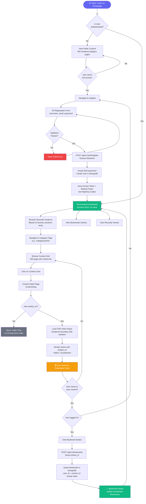
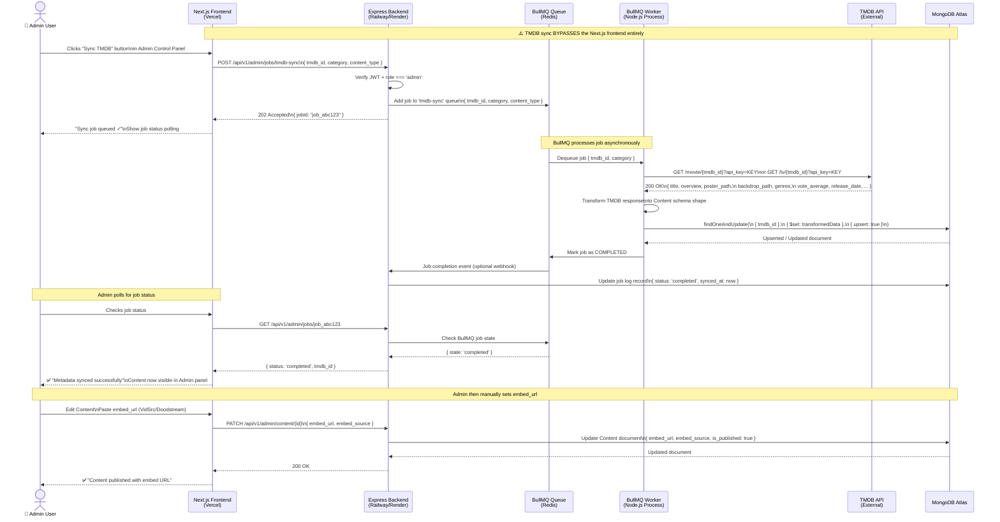
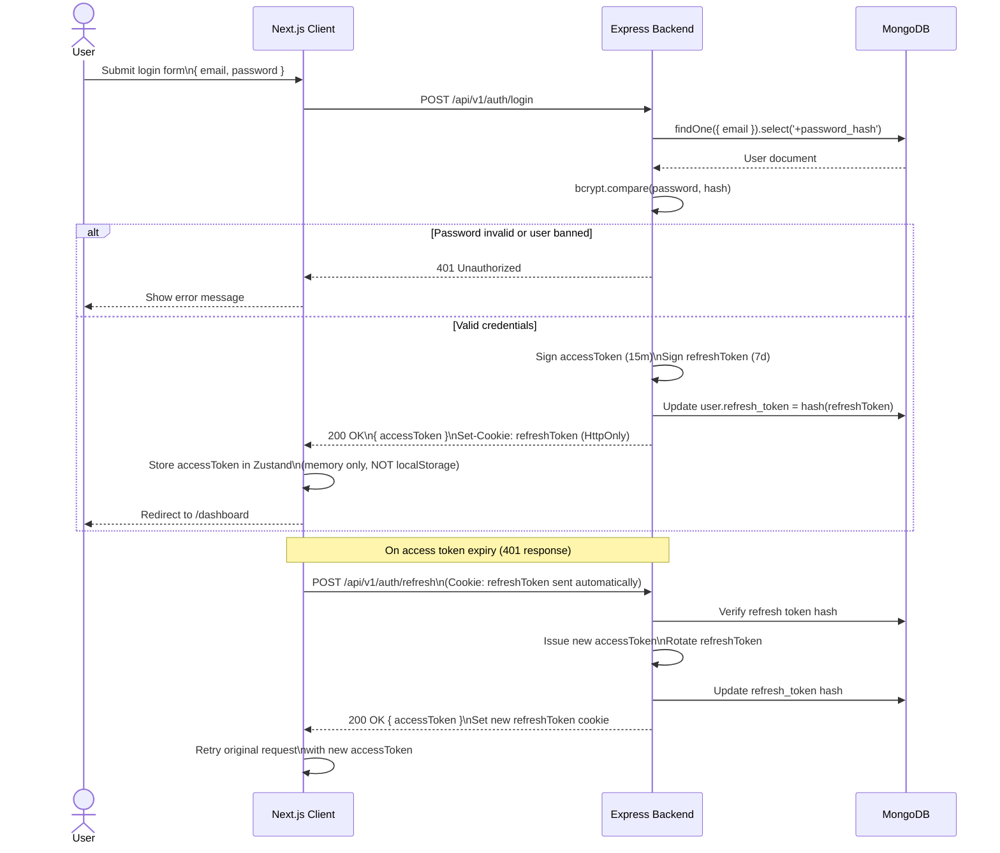
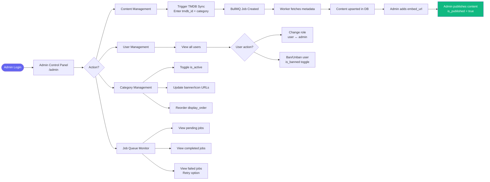
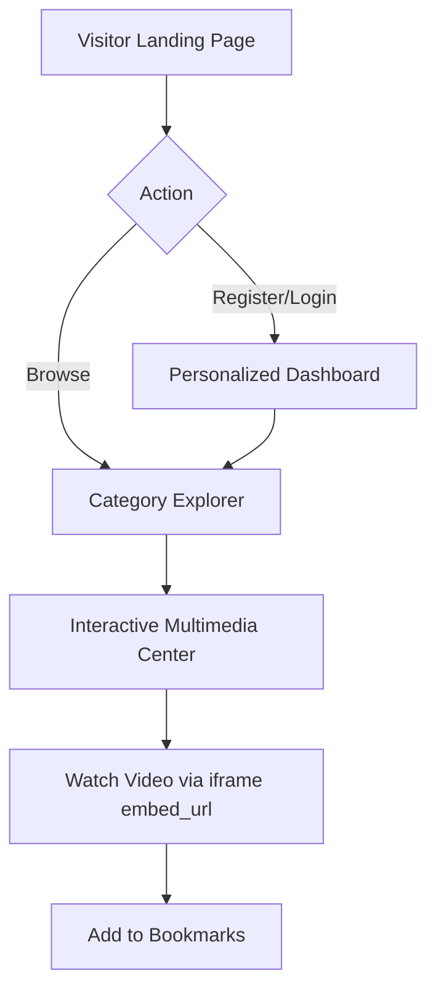
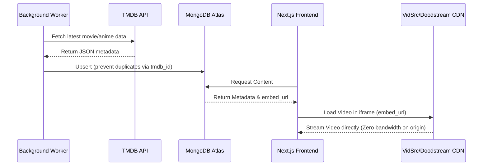

# Fan Hub Plus — Flow Memory (System Logic)

> **AGENT INSTRUCTION**: Use these diagrams as the canonical reference for user journey logic and TMDB sync architecture. Do NOT implement flows that contradict these diagrams.

---

## 1. User Journey Flowchart

Maps the complete user lifecycle from first visit to bookmarking content.

---

## 2. TMDB Metadata Fetching Sequence Diagram

Shows the background job pipeline that fetches content metadata from TMDB **without involving the Next.js frontend**.

---

## 3. Authentication Flow Diagram

---

## 4. Admin Content Management Flow

---

## 5. SRS Compact Diagrams (Quick Reference)

> **Source**: Aptech TechWiz SRS system logic specification.
> These are the concise canonical diagrams from the SRS. Sections 1–4 above contain the full extended versions.

### A. User Journey (Next.js Client)

### B. TMDB Sync & Streaming Architecture (Express Server)

> **Key insight from diagram B**: The Next.js frontend never contacts TMDB directly.
> All metadata flows through the Express BullMQ worker → MongoDB Atlas pipeline.
> Video bandwidth is entirely offloaded to the third-party CDN — zero origin streaming cost.
